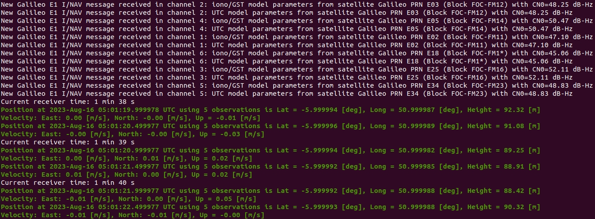
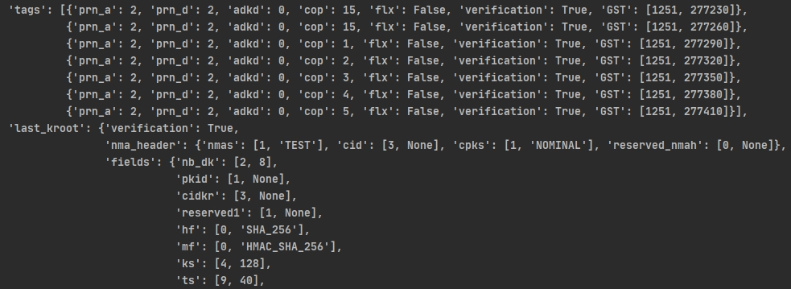

# OSNMA-SDR-SIM

OSNMA-SDR-SIM generates **OSNMA-enabled** Galileo baseband signal data streams, which can be converted to RF using software-defined radio (SDR) platforms.

- Galileo E1B/C signal generation
- OSNMA data generation
- USRP TX support 
- File sink

## Requirements

1. g++
2. Cmake
3. Curses
4. UHD (usrp api and dev library)
5. Boost
6. pynput (optional, for real-time location update via keyboard)

```
sudo apt-get install -y libuhd-dev uhd-host gnss-sdr g++ libncurses-dev cmake pkg-config libboost-dev libglib2.0-dev build-essential
pip3 install pynput
```

For evaluation, you will also need **GNSS-SDR** (https://gnss-sdr.org/) and **OSNMAlib** (https://github.com/Algafix/OSNMA).

GNSS-SDR installation with package manager on most Linux distros
```
sudo apt install gnss-sdr
```
For more installation options please check their website.
## Installation
```
git clone https://github.com/Haiyang-Wong/OSNMA-SDR-SIM.git
cd OSNMA-SDR-SIM
mkdir build && cd build
cmake ../
make
```

## Execution

Usage, help and options
```
Usage: ./usrp_galileo [options]
Options:
  -e <Ephemeris>   RINEX navigation file for Galileo ephemerides (required)
  -o <File sink>   File to store IQ samples (default: ./galileosim.ishort)
  -u <user_motion> User motion file (dynamic mode)
  -l <location>    Lat,Lon,Hgt (static mode) e.g. 35.274,137.014,100
  -t <date,time>   Scenario start time YYYY/MM/DD,hh:mm:ss
  -T <date,time>   Overwrite TOC and TOE to scenario start time
  -d <duration>    Duration [sec] (default: 300)
  -s <subframe>    Auxiliary OSNMA data (associated with -t)
  -a <rf_gain>     Absolute RF gain in [0 ... 60] (default: 30)
  -U <use usrp>    Disable USRP (-U 1) (default: true)
  -b <bitstream>   Disable Bit stream (-b 1) (default: true)
  -v <verbose>     Enable verbose output (default: false)
```

Executing the following command will generate a OSNMA-enabled Galileo signal file for the location -6,51,100 starting from 2023/08/16,05:00:01. The generated samples will be stored in **osnmasim.bin** as interleaved shorts (I<sub>1</sub>Q<sub>1</sub>, I<sub>2</sub>Q<sub>2</sub>, ... , I<sub>n</sub>Q<sub>n</sub>) @ 2.6e6 samples/sec

```
./osnma-sdr-sim -l -6,51,100 -t 2023/08/16,05:00:01 -s ../16_AUG_2023_GST_05_00_01_fixed.csv  -e ../rinex_files/20230816.rnx -o ../osnmasim.bin -U 1 -b 0 -d 360
```

## Evaluation

The generated Galileo signal has been tested with GNSS-SDR and OSNMAlib. For OSNMAlib, you need to annotate the dummy page detection code, as shown below.

```python
#if self._filter_page(page):

    #continue
```

Here are evaluation results.





