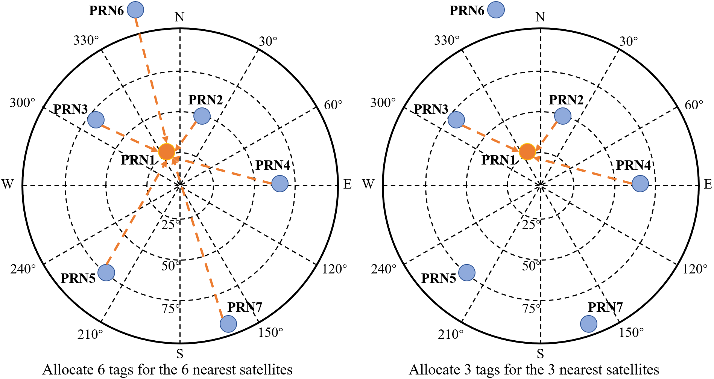
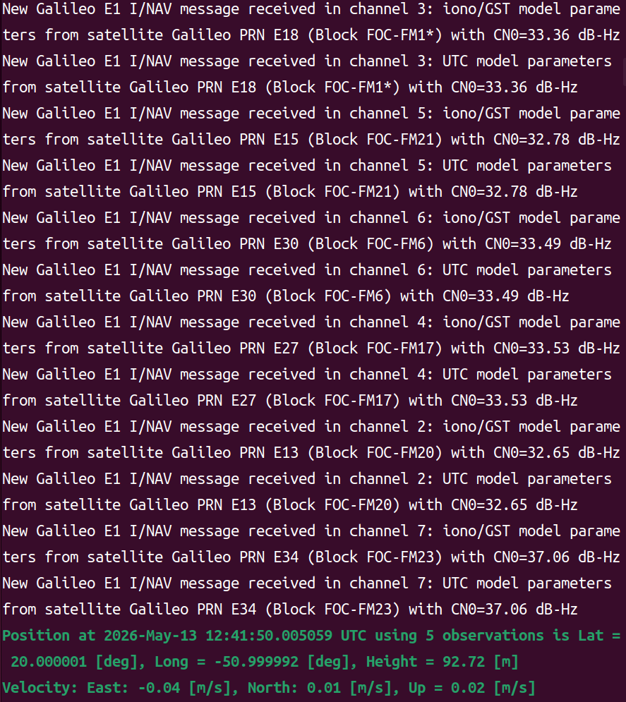
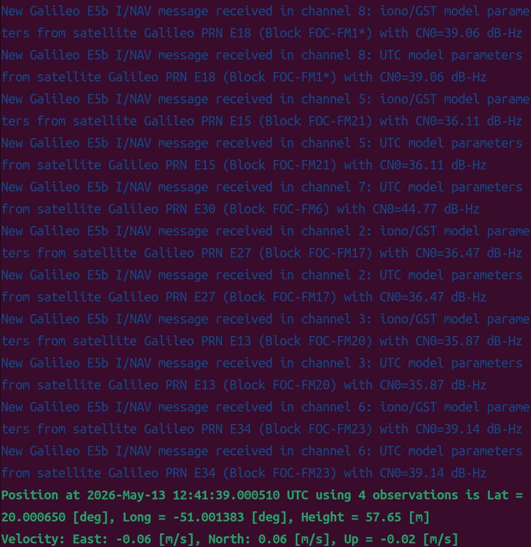
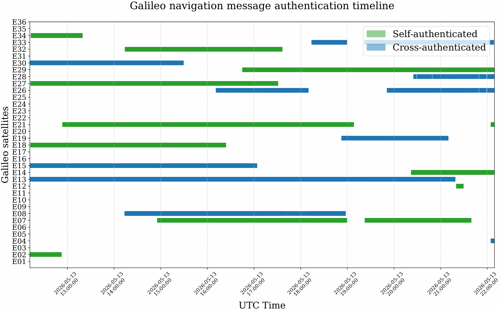
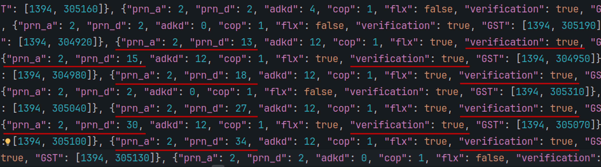

# OSNMA-SDR-SIM

An open-source OSNMA-enabled Galileo signal simulation platform that supports OSNMA-enabled signal generation, real-time software-defined radio (SDR) transmission, and receiver-side authentication evaluation. 

- Galileo E1-B signal generation with **integrated OSNMA**
- **E5b signals** generation (for cross-band authentication)
- **USRP TX** and file sink
- **Cross-authentication** (cross-satellite authentication and cross-band authentication)
- **Configurable** signals and OSNMA parameters
- **Successfully tested** using GNSS-SDR and OSNMAlib.

## Requirements

1. g++
2. Cmake
3. UHD (usrp api and dev library)

```
sudo apt-get install -y libuhd-dev uhd-host gnss-sdr g++ libncurses-dev cmake pkg-config libboost-dev libglib2.0-dev build-essential
```

For evaluation, you need **GNSS-SDR** (https://gnss-sdr.org/) and **OSNMAlib** (https://github.com/Algafix/OSNMA). Please see their project for more installation options.

## Installation
```
git clone https://github.com/Haiyang-Wong/OSNMA-SDR-SIM.git
cd OSNMA-SDR-SIM
mkdir build && cd build
cmake ../
make
```

## Execution

Build the project, enter the `build` directory, and run:

```
./osnma-sdr-sim -f ../config/run_config.ini
```

Example configuration:

```
location=20,-51,100
start_time=2026/05/13,12:41:01
osnma_file=../auxiliary_osnma/13_MAY_2026_GST_12_11_01_keychain.csv
rinex_file=../rinex_files/2026_05_13.rnx
output_file=../../OSNMA-SIM.bin
usrp=1
bit=0
duration=600
enable_e5=true
cross_auth_neighbor_count=4
cross_auth_mode=3
no_osnma_prns=[]
```

Configuration fields:

| Field                       | Description                                                  |
| --------------------------- | ------------------------------------------------------------ |
| `location`                  | Static receiver position, formatted as `lat,lon,height`, for example `20,-51,100`. |
| `start_time`                | Scenario start time, formatted as `YYYY/MM/DD,hh:mm:ss`.     |
| `osnma_file`                | Auxiliary OSNMA data (CSV-format) associated with `start_time`. |
| `rinex_file`                | Galileo RINEX navigation file.                               |
| `output_file`               | E1 output IQ sample file. Samples are interleaved signed 16-bit IQ values. |
| `output_file_e5`            | Optional E5b output IQ sample file. If omitted, the simulator derives it from `output_file`, for example `OSNMA-SIM.bin` becomes `OSNMA-SIM_e5.bin`. |
| `usrp`                      | `1` disables USRP transmission and writes to file; `0` enables USRP transmission. |
| `bit`                       | `0` disables bit stream output; `1` enables bit stream output. |
| `duration`                  | Scenario duration in seconds.                                |
| `enable_e5`                 | `true` generates E5b together with E1; `false` runs E1 only. |
| `cross_auth_neighbor_count` | Number of neighboring satellites used for cross-authentication. |
| `cross_auth_mode`           | Cross-satellite authentication mode, the valid range is 1–3.1 indicates full connectivity, while 2 and 3 represent connected satellite tags used/ not used for cross-satellite authentication, respectively. |
| `no_osnma_prns`             | Optional PRN list for satellites without OSNMA in cross-authentication modes, for example `[]` or `[13,18,30]`. |

To generate only Galileo E1 signal containing OSNMA data:

```
enable_e5=false
```

To generate both Galileo E1 (containing OSNMA data) and Galileo E5b signals:

```
enable_e5=true
```

The E1 and E5b samples are generated generated at 2.6 MHz and 20.46 MHz, respectively.

### Cross Authentication

#### Cross-satellite Authentication

For each connected satellite (i.e., a satellite transmitting OSNMA data), the **number of disconnected satellites** to be authenticated can be specified. Then, based on an **inter-satellite distance** strategy, these **disconnected satellite tags are allocated to the corresponding tag slots**. The figure below illustrates different **numbers** of cross-authentication satellite and **tag allocation** strategies.



| Subframe ID |              Tag allocation (six satellites)              |            Tag allocation (three satellites)             |
| :---------: | :-------------------------------------------------------: | :------------------------------------------------------: |
|      0      |      [PRN1, **PRN2**, PRN1,**PRN3**, PRN1, **PRN4**]      |     [PRN1, **PRN2**, PRN1,**PRN3**, PRN1, **PRN4**]      |
|      1      | [PRN1, **PRN5**, **PRN6**, PRN1, **PRN7**, **PRN1(12E)**] | [PRN1, **PRN2**, **PRN3**,PRN1, **PRN4**, **PRN1(12E)**] |
|      2      |     [PRN1, **PRN2**, PRN1, **PRN3**, PRN1, **PRN4**]      |     [PRN1, **PRN2**, PRN1,**PRN3**, PRN1, **PRN4**]      |
|      3      | [PRN1, **PRN5**, **PRN6**, PRN1, **PRN7**, **PRN1(12E)**] | [PRN1, **PRN2**, **PRN3**,PRN1, **PRN4**, **PRN1(12E)**] |

#### Cross-band Authentication

The simulation platform simultaneously generates E1 and E5b signals for user-defined locations and times, the **navigation messages within these two signals are identical at the subframe level**. Consequently, the receiver can utilize the **OSNMA data from the E1** band to **authenticate the navigation messages in the E5b** band.

## Evaluation

The generated Galileo signal has been tested with **GNSS-SDR** and **OSNMAlib**. This project different conf files for offline or real-time processing with GNSS-SDR. Additionally, it offers several OSNMA-related public key files, auxiliary OSNMA data, and ephemeris files to facilitate reproducible experiments and evaluations. 

The PVT solution and OSNMA authentication results from GNSS-SDR are shown in the figure below.





OSNMAlib supports cross-band authentication, but the dummy page detection code must first be annotated as shown below.

```python
#if self._filter_page(page):

    #continue
```

The figure below illustrates the authentication of all E5b satellites using the PRN2 satellite on the E1 band.



### Future work

+ **Optimize the tag allocation strategy**. For example, design tag allocation strategies based on **satellite-user geometric information**, apply FLX elements to other ADKD types.
+ **Broader evaluation** under different OSNMA configurations.
+ Cross-authentication for **other satellite constellations**.

## Acknowledgements

+ This project was originally developed based on [GALILEO-SDR-SIM](https://github.com/harshadms/galileo-sdr-sim).
